Project's website: http://StudentEng2016.github.io/

FarmBot
=======

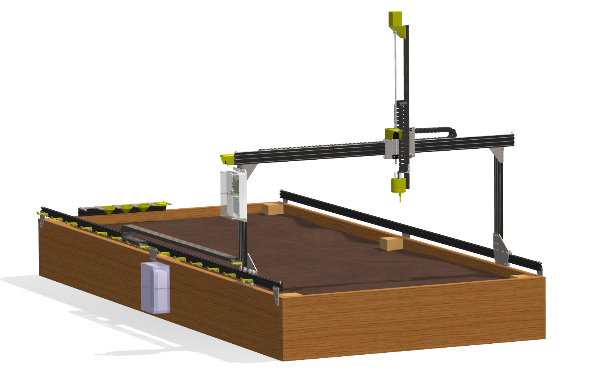

Image source: [@00000001]

**From: Alisha Singh Chauhan, Adanegbe Amadasun**

**Discipline: Computer Engineering Technology**

**Date Submitted: March 03,2017**

\pagebreak 

Declaration of Joint Authorship
===============================

We, Alisha Singh Chauhan and Adanegbe Amadasun, students of the Applied
Technology department hereby declare that the following technical report
submitted for CENG 355 Computer Systems Project is expressed in our own words.  
The research which has been used from various sources, such as words, numerical
data, figures, tables etc. has been either paraphrased or cited separately. The
original sources of cited work may be located using APA style in References page
at the back.

\pagebreak 

Approved Proposal
=================

Prepared by Adanegbe Amadasun, Alisha Singh Chauhan Computer Engineering
Technology Students

Executive Summary
-----------------

As students in the Computer Engineering Technology program, we will be
integrating the knowledge and skills we have learned from our program into this
Internet of Things themed capstone project. This proposal requests the approval
to build the hardware portion that will connect to a database as well as to a
mobile device application. The Internet connected hardware will include a custom
PCB with sensors and actuators for an automated farming device. The mobile
device functionality will include photo sensors, temperature sensors and
moisture sensors, which will be further detailed in the mobile application
proposal. We will be collaborating with the following company/department. In the
winter semester, we planned to form a group together as we both are building
similar hardware this term and working on its mobile application. The hardware
was completed in CENG 317 Hardware Production Techniques independently and the
application was completed in CENG 319 Software Project. These will be integrated
in CENG 355 Computer Systems Project.

Background
----------

FarmBot is going to address some the problems the agricultural industry faces,
such as loss of money, inefficiency of some equipment and exploitation of
resources. FarmBot is going to be more economical and ecofriendly unlike other
agricultural equipment being used. It incorporates precision farming, which
happens to be a concept based on observing, measuring and responding to inter-
and intra-field variability in crops. The device is going to be constructed in
the FarmBot company. It is going to be made of an Arduino Mega 2560, Raspberry
Pi 3, disassembled hardware packages and other software sources. The FarmBot
Genesis runs on custom built tracks and other supporting infrastructure which
needs to be self assembled. The robot itself relies on a GUI platform which
users can access through the FarmBot’s web app. The physical robotic system is
set in alignment with the crops that are plotted out in the virtual version on
the web app. This is how FarmBot can be efficient and reliably distribute water,
fertilizer and other elements to keep the plants healthy and striving with
minimun wastage. The device is going to be cheaper than conventional tools and
cost-effective.

We have searched for prior art via Humber’s IEEE subscription selecting “My
Subscribed Content” [@5306920] and have found and read [@7059344] which provides
insight into similar efforts.

In the Computer Engineering Technology program, we have learned about the
following topics from the respective relevant courses:

-   Java Docs from CENG 212 Programming Techniques In Java,

-   Construction of circuits from CENG 215 Digital And Interfacing Systems,

-   Rapid application development and Gantt charts from CENG 216 Intro to
    Software Engineering,

-   Micro computing from CENG 252 Embedded Systems,

-   SQL from CENG 254 Database With Java,

-   Web access of databases from CENG 256 Internet Scripting; and,

-   Wireless protocols such as 802.11 from TECH152 Telecom Networks.

This knowledge and skill set will enable me to build the subsystems and
integrate them together as my capstone project.

Methodology
-----------

This proposal is assigned in the first week of class and is due at the beginning
of class in the second week of the fall semester. My coursework will focus on
the first two of the 3 phases of this project:  
Phase 1 Hardware build.  
Phase 2 System integration.  
Phase 3 Demonstration to future employers.

*Phase 1 Hardware build*

The hardware build will be completed in the fall term. It will fit within the
CENG Project maximum dimensions of 12 13/16" x 6" x 2 7/8" (32.5cm x 15.25cm x
7.25cm) which represents the space below the tray in the parts kit. The highest
AC voltage that will be used is 16Vrms from a wall adaptor from which +/- 15V or
as high as 45 VDC can be obtained. Maximum power consumption will be 20 Watts.

*Phase 2 System integration*

The system integration will be completed in the fall term.

*Phase 3 Demonstration to future employers*

This project will showcase the knowledge and skills that we have learned to
potential employers.

The tables below provide rough effort and non-labour estimates respectively for
each phase. A Gantt chart will be added by week 3 to provide more project
schedule details and a more complete budget will be added by week 4. It is
important to start tasks as soon as possible to be able to meet deadlines.

| **Labour Estimates**                                                                                                                                                                                                                                                                                                                  | **Hrs**        | **Notes**                                                                                                                      |
|---------------------------------------------------------------------------------------------------------------------------------------------------------------------------------------------------------------------------------------------------------------------------------------------------------------------------------------|----------------|--------------------------------------------------------------------------------------------------------------------------------|
| **Phase 1**                                                                                                                                                                                                                                                                                                                           |                |                                                                                                                                |
| Writing proposal.                                                                                                                                                                                                                                                                                                                     | 9              | Tech identification quiz.                                                                                                      |
| Creating project schedule. Initial project team meeting.                                                                                                                                                                                                                                                                              | 9              | Proposal due.                                                                                                                  |
| Creating budget. Status Meeting.                                                                                                                                                                                                                                                                                                      | 9              | Project Schedule due.                                                                                                          |
| Acquiring components and writing progress report.                                                                                                                                                                                                                                                                                     | 9              | Budget due.                                                                                                                    |
| Mechanical assembly and writing progress report. Status Meeting.                                                                                                                                                                                                                                                                      | 9              | Progress Report due (components acquired milestone).                                                                           |
| PCB fabrication.                                                                                                                                                                                                                                                                                                                      | 9              | Progress Report due (Mechanical Assembly milestone).                                                                           |
| Interface wiring, Placard design, Status Meeting.                                                                                                                                                                                                                                                                                     | 9              | PCB Due (power up milestone).                                                                                                  |
| Preparing for demonstration.                                                                                                                                                                                                                                                                                                          | 9              | Placard due.                                                                                                                   |
| Writing progress report and demonstrating project.                                                                                                                                                                                                                                                                                    | 9              | Progress Report due (Demonstrations at Open House Saturday, November 7, 2015 from 10 a.m. - 2 p.m.).                           |
| Editing build video.                                                                                                                                                                                                                                                                                                                  | 9              | Peer grading of demonstrations due.                                                                                            |
| Incorporation of feedback from demonstration and writing progress report. Status Meeting.                                                                                                                                                                                                                                             | 9              | 30 second build video due.                                                                                                     |
| Practice presentations                                                                                                                                                                                                                                                                                                                | 9              | Progress Report due.                                                                                                           |
| 1st round of Presentations, Collaborators present.                                                                                                                                                                                                                                                                                    | 9              | Presentation PowerPoint file due.                                                                                              |
| 2nd round of Presentations                                                                                                                                                                                                                                                                                                            | 9              | Build instructions up due.                                                                                                     |
| Project videos, Status Meeting.                                                                                                                                                                                                                                                                                                       | 9              | 30 second script due.                                                                                                          |
| **Phase 1 Total**                                                                                                                                                                                                                                                                                                                     | **135**        |                                                                                                                                |
| **Phase 2**                                                                                                                                                                                                                                                                                                                           |                |                                                                                                                                |
| Meet with collaborators                                                                                                                                                                                                                                                                                                               | 9              | Status Meeting                                                                                                                 |
| Initial integration.                                                                                                                                                                                                                                                                                                                  | 9              | Progress Report                                                                                                                |
| Meet with collaborators                                                                                                                                                                                                                                                                                                               | 9              | Status Meeting                                                                                                                 |
| Testing.                                                                                                                                                                                                                                                                                                                              | 9              | Progress Report                                                                                                                |
| Meet with collaborators                                                                                                                                                                                                                                                                                                               | 9              | Status Meeting                                                                                                                 |
| Meet with collaborators                                                                                                                                                                                                                                                                                                               | 9              | Status Meeting                                                                                                                 |
| Incorporation of feedback.                                                                                                                                                                                                                                                                                                            | 9              | Progress Report                                                                                                                |
| Meet with collaborators                                                                                                                                                                                                                                                                                                               | 9              | Status Meeting                                                                                                                 |
| Testing.                                                                                                                                                                                                                                                                                                                              | 9              | Progress Report                                                                                                                |
| Meet with collaborators                                                                                                                                                                                                                                                                                                               | 9              | Status Meeting                                                                                                                 |
| Prepare for demonstration.                                                                                                                                                                                                                                                                                                            | 9              | Progress Report                                                                                                                |
| Complete presentation.                                                                                                                                                                                                                                                                                                                | 9              | Demonstration at Open House Saturday, April 9, 2016 10 a.m. to 2 p.m.                                                          |
| Complete final report. 1st round of Presentations.                                                                                                                                                                                                                                                                                    | 9              | Presentation PowerPoint file due.                                                                                              |
| Write video script. 2nd round of Presentations, delivery of project.                                                                                                                                                                                                                                                                  | 9              | Final written report including final budget and record of expenditures, covering both this semester and the previous semester. |
| Project videos.                                                                                                                                                                                                                                                                                                                       | 9              | Video script due                                                                                                               |
| **Phase 2 Total**                                                                                                                                                                                                                                                                                                                     | **135**        |                                                                                                                                |
| **Phase 3**                                                                                                                                                                                                                                                                                                                           |                |                                                                                                                                |
| Interviews                                                                                                                                                                                                                                                                                                                            | TBD            |                                                                                                                                |
| **Phase 3 Total**                                                                                                                                                                                                                                                                                                                     | **TBD**        |                                                                                                                                |
| **Material Estimates**                                                                                                                                                                                                                                                                                                                | **Cost**       | **Notes**                                                                                                                      |
| **Phase 1**                                                                                                                                                                                                                                                                                                                           |                |                                                                                                                                |
| A microcomputer composed of a quad-core Windows 10 IoT core compatible Broadcom BCM2836 SoC with a 900MHz Application ARM Cortex-A7 32 bit RISC v7-A processor core stacked under 1GB of 450MHz SDRAM, 10/100 Mbit/s Ethernet, GPIO, UART, I²C bus, SPI bus, 8 GB of Secure Digital storage, a power supply, and a USB Wi-Fi adaptor. | \>\$80.00      | An example of a retailer: [3].                                                                                                 |
| Peripherals with cables                                                                                                                                                                                                                                                                                                               |                |                                                                                                                                |
| Sensors                                                                                                                                                                                                                                                                                                                               |                |                                                                                                                                |
| Actuators                                                                                                                                                                                                                                                                                                                             |                |                                                                                                                                |
| Hardware, etc.                                                                                                                                                                                                                                                                                                                        |                |                                                                                                                                |
| **Phase 1 Total**                                                                                                                                                                                                                                                                                                                     | **\>\$200.00** |                                                                                                                                |
| **Phase 2**                                                                                                                                                                                                                                                                                                                           |                |                                                                                                                                |
| Materials to improve functionality, fit, and finish of project.                                                                                                                                                                                                                                                                       |                |                                                                                                                                |
| **Phase 2 Total**                                                                                                                                                                                                                                                                                                                     | **TBD**        |                                                                                                                                |
| **Phase 3**                                                                                                                                                                                                                                                                                                                           |                |                                                                                                                                |
| Off campus colocation                                                                                                                                                                                                                                                                                                                 | \<\$100.00     | An example: [4].                                                                                                               |
| *Shipping*                                                                                                                                                                                                                                                                                                                            | *TBD*          |                                                                                                                                |
| *Tax*                                                                                                                                                                                                                                                                                                                                 | *TBD*          |                                                                                                                                |
| *Duty*                                                                                                                                                                                                                                                                                                                                | *TBD*          |                                                                                                                                |
| **Phase 3 Total**                                                                                                                                                                                                                                                                                                                     | **TBD**        |                                                                                                                                |

Concluding Remarks
------------------

This proposal presents a plan for providing an IoT solution for FarmBot This is
an opportunity to integrate the knowledge and skills developed in our program to
create a collaborative IoT capstone project demonstrating my ability to learn
how to support projects. We request the approval of this project.

\pagebreak 

Abstract
========

The Farmbot is basically CNC farming technique which has proved to be the great
way for the production of small scale food. It has turned out to be a reliable
and approachable source to accomplish the idea of integrating an artificial
approach to take care of the cultivation. This project deals with the following
hardware components, such as PCF8591 sensors, nozzels which an inject the
substances controlled by axes with the software governed by Arduino/RAMPs stack
and internet of Raspberry Pi. This project is designed to be completed under the
time span of 3-4 months to put together everything. It gives user the
opportunity to customize their own farm using the web app.

\pagebreak 

Table of Contents
=================

[Declaration of Joint Authorship](#Declaration of Joint Authorship)

[Approved Proposal](#Approved Proposal)

[Executive Summary](#Executive Summary)

[Background](#Background)

[Methodology](#Methodology)

[Concluding Remarks](#Concluding Remarks)

[Abstract](#Abstract)

1.	[Introduction](#Introduction)

2.	[Project Description](#Project%20Description)

2.1	[Purpose](#Purpose)

2.2	[Project Overview](#Project%20Overview)

2.3	[Hardware Specification](#Hardware%20Specification)

2.4	[Software Specification](#Software%20Specification)

2.4.1	[Database work breakdown](#Database work breakdown)

2.4.2	[Application work breakdown](#Application work breakdownwn)

2.4.2	[Web and work breakdown](#Web and work breakdown)

2.5	[Build Instruction](#Build%20Instruction)

2.5.1	[Bill of Materials](#Bill of Materials)

2.5.2	[Time Commitment](#Time Commitment)

2.5.3	[Mechanical Assembly](#Mechanical Assembly)   

2.5.4	[PCB and Soldering](#PCB and Soldering)   

2.5.5	[Power Up](#Power Up)

2.5.6	[Unit Testing](#Unit Testing)

2.5.7	[Production Testing](#Production Testing) 

3.  [Progress Report](#Progress Report)

3.1	[Report 1 (Week 5)](#Report 1 (Week 5))

3.2	[Report 2 (Week 6)](#Report 2 (Week 6))

4.	[Conclusion](#Conclusion)

5.	[Recommendations](#Recommendations)

6.	[References](#References)

\pagebreak 

List of Illustrations
=====================

-   Figure 1: FarmBot

-   Figure 2: Detailed Farmbot diagram

-   Figure 3: Parts of a FarmBot

-   Figure 4: Raspberry pi 3

-   Figure 5: Arduino mega2560

-   Figure 6: Bi-polar Stepper motor

-   Figure 7: Software Overview

\pagebreak 

1. Introduction
===============

An open source automated farming device which operates like a 3D printer. But
instead of extruding plastic, its tools are seed injectors, watering nozzles,
sensors etc.

\pagebreak 

2. Project Description
======================

**2.1 Purpose**

FarmBot is going to address some the problems the agricultural industry faces
like lost of money, how ineffective some of their equipment are and how they
waste resources.

**2.2 Hardware Specification**

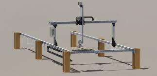

Image source: [@00000003]

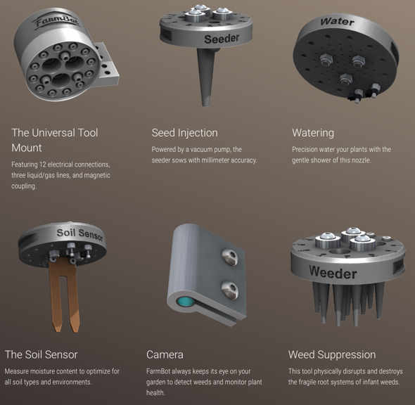

Image source: [@00000002]

(Describe farmbot parts)

FarmBot will be able to perform the following task:

-   Monitor the temperature around the plant,

-   Provide light to the plant.

The hardware component for FarmBot that We have are:

-   Raspberry pi 3 – It is used to receive data from FarmBot and send it to the
    Arduino

-   Arduino mega 2560 – It is used to control the bi-polar stepper motor

-   Sensor Hat (light and temperature) – It is used to receive data about light
    and temperature from surrounding.

-   Bi-polar Stepper motor – It controls the movement of the FarmBot

**2.3 Software Specification**
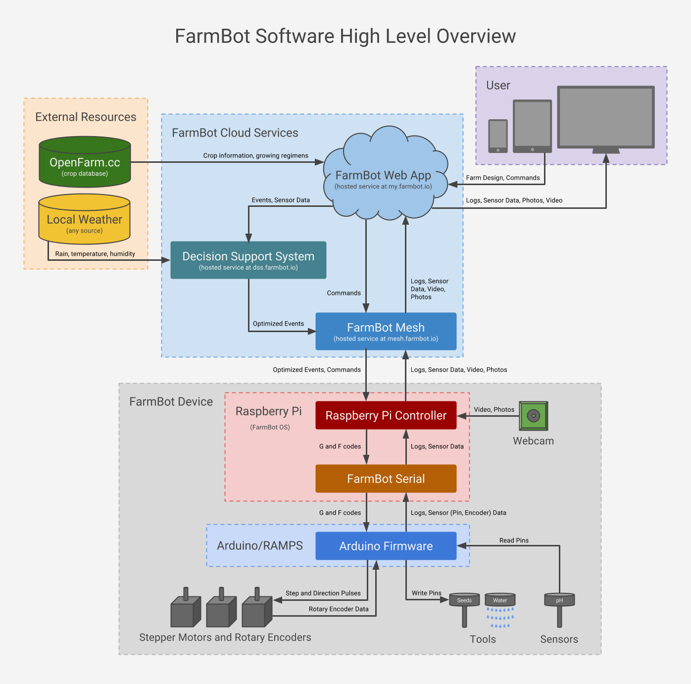

Image source: [@00000007]

**2.3.1 Database work breakdown**

Currently, We only have a local database for our FarmBot project. The database
stores the plant number, date, and name locally. Once the app is deleted the
users will lose access to all their data.

We plan on getting a server to so all users data can be stored in the cloud and
can be accessed by them at any time.

(Developed by Adanegbe Amadasun)

**2.3.2 Application work breakdown**

FarmBot is going to be more economical and ecofriendly unlike other agricultural
equipment being used. It incorporates precision farming, which happens to be a
concept based on observing, measuring and responding to inter and intra-field
variability in crops. The device is going to be constructed be the FarmBot
company, it is going to be made of an Arduino Mega 2650, Raspberry Pi 3, Sensor
hat (which can read temperature, light, and soil condition), and Bi-polar
stepper motor.

We plan on using the an arduino mege2560 to control the bi-polar stepper motor
to make it move on its X-axis.

(Developed by Alisha Singh Chauhan)

**2.3.3 Web and work breakdown**

An app was created to use for the FarmBot, this app would be used to control the
FarmBot to plant seed at desire position in the bed. Also, the user can choose
the option of giving the FarmBot light for a duration of time, watering the
plant etc.

After installing the app on your mobile phone, users will be prompt to create an
account by choosing user name and password. This will then give them access to
their FarmBot and its data stored in the cloud.

The user can then pick the seed of the crop they want to plant, and the care
option they want to apply to the seed (i.e. The light duration, or how
frequently they want to water the plant) and submit the options they picked

The user would be given the access to control the FarmBot and apply the option
picked from the previous screen.

We plan on connecting FarmBot’s app with raspberry pi, so that users can be able
to send data to it.

We would both work on this.

(Developed by Adanegbe Amadasun and Alisha Singh Chauhan)

**2.5 Build Instruction**

**2.5.1 Introduction**

The Farmbot is designed in a such a way that it will work and execute the
commands given by the user through software. The working is clearly explained
with the design model given below.

**2.5.2 Bill of Materials**

-   Raspberry Pi 3 Complete Starter Kit - 32 GB Edition - \$74.35 [@12345678]

Image source: [@00000004]

-   Arduino Mega - \$49.95 [@00000008]	
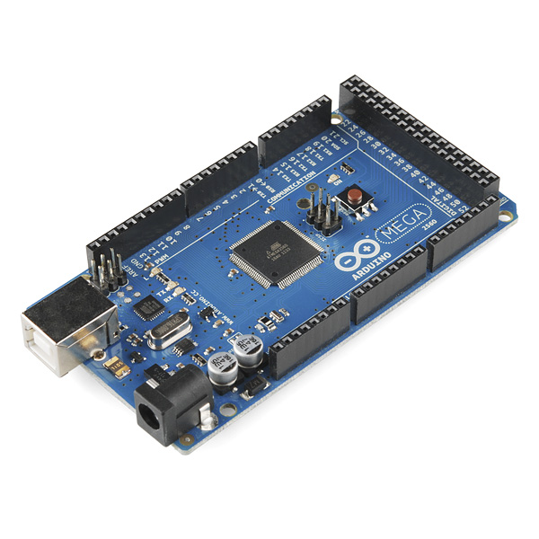
Image source: [@00000005]

-   5v Switching Power Supply - \$15 [@000000015]
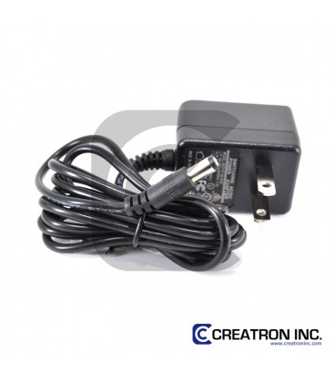
Image source: [@00000015]

-   Ramps 1.4 for 3D Printer – \$35.95 [@00000009]
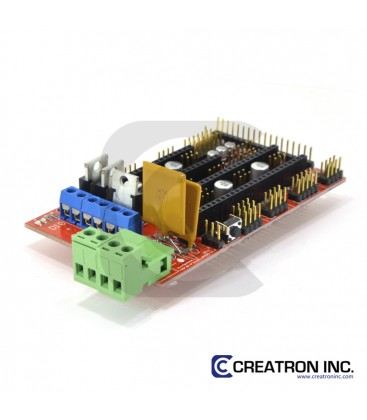
Image source: [@00000009]

-   Stepper Motor Driver - \$14.25 [@00000010]
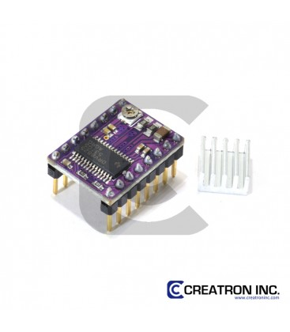
Image source: [@00000010]

-   Bipolar Stepper Motor - \$29.50 [@00000011]
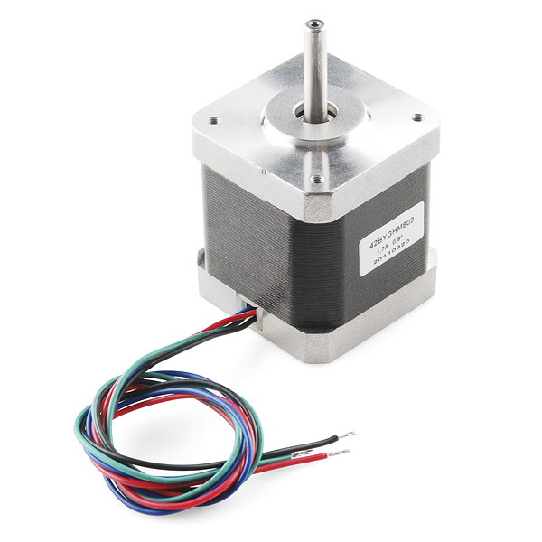
Image source: [@00000006]

-   Time Pulley - \$9.00 [@00000012]
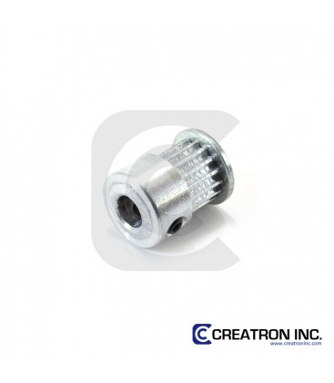
Image source: [@00000012]

-   Rotary - \$4.95 [@00000013]
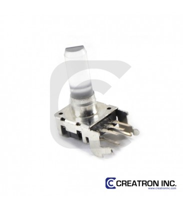
Image source: [@00000013]

-   Timing Belt - \$19 [@00000014]
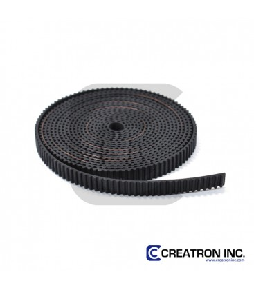
Image source: [@00000014]

-   Total = \$284.70 + HST

**2.5.3 Time Commitment**

The design model needs at least 5-6 hours to put everything all together. It
includes the laser cutting of the outer cage and then soldiering all the
components into the case appropriately.

 **Task**									 | **Estimated Time**
|--------------------------------------------|---------------------| 
|Printing PCBs 								 | 30 mins			   | 
| Soldering PCBs							 | 2 hrs 			   | 
| Testing Sensors and motor 				 | 2 hrs 			   |
| Designing and Laser-cutting Box 	   		 | 40 mins 			   |
|Assemblying parts 							 | 1 hr   			   | 
|Uploading FarmBot firmware (Raspberry pi 3) | 30 mins			   |
|Uploading FarmBot firmware (Arduino) 		 | 25 mins 			   |

**2.5.4 Mechanical Assembly**

• The outer case was made by laser cutter and have a transparent shielding to
have a clear view of the components placed inside.

• The Arduino is placed underneath the Ramp Shield with approximately the gap of
half an inch.

• Adjacent to that the stepper motor is being placed with its one end outwards
to have a connection with the belt

• Setup the Raspberry Pi with the farmbot firmware on it so that it generates a
gateway for the connection in between web application and the mobile device.

• Get the firmware for the Arduino as well.

• Assemble the firmware for the Ramp shield.

• Add the stepper motor and generate the connection of Arduino and pi.

• Enable the stepper motor and ramp shield by giving an adequate power supply.

**2.5.5 PCB and Soldering**

**2.5.6 Power Up and Testing**

The project can be tested by giving the commands from the mobile application and
the belt moves according to the distance mentioned by the user. The Raspberry Pi
becomes a hotspot and enables the Wi-Fi connection for the mobile device so that
it can connect

\pagebreak 

3. Progress Report
==================

**3.1 Report 1 (Week 5)**

From: Adanegbe Amadasun Cc: Alisha Singh Chauhan

Dear Sir,

This is our email regarding progress report and the milestone we have covered so
far on our project. We are still behind schedule because I did not make a case
from last semester for our project. Last semester, I could not keep up with the
schedule I created for myself because of my course load and some of the parts I
was working with were new to me. But this semester, I have a better
understanding of my project and how to do it. We are trying to come up with
ideals on how on the stepper motor move different parts of the FarmBot. After we
are done with that, we would start working on the code need to move the stepper
motor. We have an android app working which we would use to connect to our
FarmBot. We have built a case for our FarmBot and we are currently trying to
create a pulley system.  
Last week Friday, we had success in uploading teacup firmware into our Arduino
for the pulley system. Our budget has changed because I have planning on
purchasing new parts. I am first going to check the Alisha's parts to m Alisha
project to know which of the we can use.

Sincerely, Adanegbe Amadasun

**3.2 Report 2 (Week 6)**

From: Adanegbe Amadasun Cc: Alisha Singh Chauhan Dear Sir,

This is our email regarding progress report and the milestone we have covered so
far on our project. We now have a better understanding on how to go about our
project. We worked with Vlad last week Friday to accomplish various task for our
project such as: • Tuning our stepper driver to allow 0.6 amps of current •
Lasercut a hole through our case for the pulling system • We also learnt how to
crimp wires, we crimp our stepper motor wire to make it easier to connect it to
ramp shield. We have built a case for our FarmBot and are still working on
creating our pulley system. Also, we had success in uploading teacup firmware
into our Arduino for the pulley system, and we are currently trying to figure
out the distance to use for stepper more to move.

Work breakdown: we have distributed the workload among us in the following way.
Database Work Breakdown: Adanegbe will be working on the database part of the
project. Currently, we only have a local database for our FarmBot project. The
database stores the plant number, date, and name locally. Once the app is
deleted the users will lose access to all their data. (Developed by Adanegbe
Amadasun)

We plan on getting a server to so all users data can be stored in the cloud and
can be accessed by them at any time

Application and work breakdown: Alisha will be proceeding with this. FarmBot is
going to be more economical and ecofriendly unlike other agricultural equipment
being used. It incorporates precision farming, which happens to be a concept
based on observing, measuring and responding to inter and intra-field
variability in crops. The device is going to be constructed be the FarmBot
company, it is going to be made of an Arduino Mega 2650, Raspberry Pi 3, Sensor
hat (which can read temperature, light, and soil condition), and Bi-polar
stepper motor.

Hardware breakdown: We are working on the hardware together.

Sincerely, Adanegbe Amadasun

\pagebreak 

References
==========

