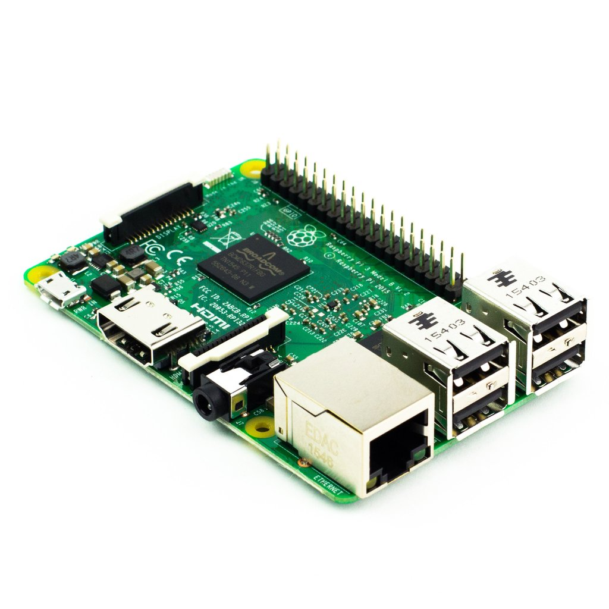

Project's website: http://StudentEng2016.github.io/

FarmBot
=======

Image source: [@00000001]

**From: Alisha Singh Chauhan, Adanegbe Amadasun**

**Discipline: Computer Engineering Technology**

**Date Submitted: March 31,2017**

\pagebreak 

Declaration of Joint Authorship
===============================

We, Alisha Singh Chauhan and Adanegbe Amadasun, students of the Applied
Technology department hereby declare that the following technical report
submitted for CENG 355 Computer Systems Project is expressed in our own words.  
The research which has been used from various sources, such as words, numerical
data, figures, tables etc. has been either paraphrased or cited separately. The
original sources of cited work may be located using APA style in References page
at the back.

\pagebreak 

Approved Proposal
=================

Prepared by Adanegbe Amadasun, Alisha Singh Chauhan Computer Engineering
Technology Students

\pagebreak 

Abstract
========

The Farmbot is basically CNC farming technique which has proved to be the great way for the production of small scale food. 
It has turned out to be a reliable and approachable source to accomplish the idea of integrating an artificial approach 
to take care of the cultivation. This project deals with the following hardware components, such as PCF8591 sensors, 
nozzels which an inject the substances controlled by axes with the software governed by Arduino/RAMPs stack and 
internet of Raspberry Pi. This project is designed to be completed under the time span of 3-4 months to put together everything. 

It gives user the opportunity to customize their own farm using the web app.  The software is also able to manipulate data maps, 
real-time logging and access an open plant data in the Open Farm database. All software is available under the MIT license 
and is available on GitHub. The hardware is designed around reproduce-ability and availability of components, 
it can be created using common tools and processes meaning it is not reliant on a single supplier.

Executive Summary
-----------------

As students in the Computer Engineering Technology program, we will be
integrating the knowledge and skills we have learned from our program into this
Internet of Things themed capstone project. This proposal requests the approval
to build the hardware portion that will connect to a database as well as to a
mobile device application. The Internet connected hardware will include a custom
PCB with sensors and actuators for an automated farming device. The mobile
device functionality will include photo sensors, temperature sensors and
moisture sensors, which will be further detailed in the mobile application
proposal. 

We will be collaborating with the following company/department. In the
winter semester, we planned to form a group together as we both are building
similar hardware this term and working on its mobile application. The hardware
was completed in CENG 317 Hardware Production Techniques independently and the
application was completed in CENG 319 Software Project. These will be integrated
in CENG 355 Computer Systems Project.

Background
----------

FarmBot is going to address some the problems the agricultural industry faces,
such as loss of money, inefficiency of some equipment and exploitation of
resources. FarmBot is going to be more economical and ecofriendly unlike other
agricultural equipment being used. It incorporates precision farming, which
happens to be a concept based on observing, measuring and responding to inter-
and intra-field variability in crops. The device is going to be constructed in
the FarmBot company. 

It is going to be made of an Arduino Mega 2560, Raspberry
Pi 3, disassembled hardware packages and other software sources. The FarmBot
Genesis runs on custom built tracks and other supporting infrastructure which
needs to be self assembled. The robot itself relies on a GUI platform which
users can access through the FarmBot’s web app. The physical robotic system is
set in alignment with the crops that are plotted out in the virtual version on
the web app. 

This is how FarmBot can be efficient and reliably distribute water,
fertilizer and other elements to keep the plants healthy and striving with
minimun wastage. The device is going to be cheaper than conventional tools and
cost-effective.

We have searched for prior art via Humber’s IEEE subscription selecting “My
Subscribed Content” [@5306920] and have found and read [@7059344] which provides
insight into similar efforts.

In the Computer Engineering Technology program, we have learned about the
following topics from the respective relevant courses:

-   Java Docs from CENG 212 Programming Techniques In Java,

-   Construction of circuits from CENG 215 Digital And Interfacing Systems,

-   Rapid application development and Gantt charts from CENG 216 Intro to
 Software Engineering,

-   Micro computing from CENG 252 Embedded Systems,

-   SQL from CENG 254 Database With Java,

-   Web access of databases from CENG 256 Internet Scripting; and,

-   Wireless protocols such as 802.11 from TECH152 Telecom Networks.

This knowledge and skill set will enable me to build the subsystems and
integrate them together as my capstone project.

Methodology
-----------

This proposal is assigned in the first week of class and is due at the beginning
of class in the second week of the fall semester. My coursework will focus on
the first two of the 3 phases of this project:  
Phase 1 Hardware build.  
Phase 2 System integration.  
Phase 3 Demonstration to future employers.

*Phase 1 Hardware build*

The hardware build will be completed in the fall term. It will fit within the
CENG Project maximum dimensions of 12 13/16" x 6" x 2 7/8" (32.5cm x 15.25cm x
7.25cm) which represents the space below the tray in the parts kit. The highest
AC voltage that will be used is 16Vrms from a wall adaptor from which +/- 15V or
as high as 45 VDC can be obtained. Maximum power consumption will be 20 Watts.

*Phase 2 System integration*

The system integration will be completed in the fall term.

*Phase 3 Demonstration to future employers*

This project will showcase the knowledge and skills that we have learned to
potential employers.

The tables below provide rough effort and non-labour estimates respectively for
each phase. A Gantt chart will be added by week 3 to provide more project
schedule details and a more complete budget will be added by week 4. It is
important to start tasks as soon as possible to be able to meet deadlines.

| **Labour Estimates**                                                                                                                                                                                                                                                                                                                  | **Hrs**        | **Notes**                                                                                                                      |
|---------------------------------------------------------------------------------------------------------------------------------------------------------------------------------------------------------------------------------------------------------------------------------------------------------------------------------------|----------------|--------------------------------------------------------------------------------------------------------------------------------|
| **Phase 1**                                                                                                                                                                                                                                                                                                                           |                |                                                                                                                                |
| Writing proposal.                                                                                                                                                                                                                                                                                                                     | 9              | Tech identification quiz.                                                                                                      |
| Creating project schedule. Initial project team meeting.                                                                                                                                                                                                                                                                              | 9              | Proposal due.                                                                                                                  |
| Creating budget. Status Meeting.                                                                                                                                                                                                                                                                                                      | 9              | Project Schedule due.                                                                                                          |
| Acquiring components and writing progress report.                                                                                                                                                                                                                                                                                     | 9              | Budget due.                                                                                                                    |
| Mechanical assembly and writing progress report. Status Meeting.                                                                                                                                                                                                                                                                      | 9              | Progress Report due (components acquired milestone).                                                                           |
| PCB fabrication.                                                                                                                                                                                                                                                                                                                      | 9              | Progress Report due (Mechanical Assembly milestone).                                                                           |
| Interface wiring, Placard design, Status Meeting.                                                                                                                                                                                                                                                                                     | 9              | PCB Due (power up milestone).                                                                                                  |
| Preparing for demonstration.                                                                                                                                                                                                                                                                                                          | 9              | Placard due.                                                                                                                   |
| Writing progress report and demonstrating project.                                                                                                                                                                                                                                                                                    | 9              | Progress Report due (Demonstrations at Open House Saturday, November 7, 2015 from 10 a.m. - 2 p.m.).                           |
| Editing build video.                                                                                                                                                                                                                                                                                                                  | 9              | Peer grading of demonstrations due.                                                                                            |
| Incorporation of feedback from demonstration and writing progress report. Status Meeting.                                                                                                                                                                                                                                             | 9              | 30 second build video due.                                                                                                     |
| Practice presentations                                                                                                                                                                                                                                                                                                                | 9              | Progress Report due.                                                                                                           |
| 1st round of Presentations, Collaborators present.                                                                                                                                                                                                                                                                                    | 9              | Presentation PowerPoint file due.                                                                                              |
| 2nd round of Presentations                                                                                                                                                                                                                                                                                                            | 9              | Build instructions up due.                                                                                                     |
| Project videos, Status Meeting.                                                                                                                                                                                                                                                                                                       | 9              | 30 second script due.                                                                                                          |
| **Phase 1 Total**                                                                                                                                                                                                                                                                                                                     | **135**        |                                                                                                                                |
| **Phase 2**                                                                                                                                                                                                                                                                                                                           |                |                                                                                                                                |
| Meet with collaborators                                                                                                                                                                                                                                                                                                               | 9              | Status Meeting                                                                                                                 |
| Initial integration.                                                                                                                                                                                                                                                                                                                  | 9              | Progress Report                                                                                                                |
| Meet with collaborators                                                                                                                                                                                                                                                                                                               | 9              | Status Meeting                                                                                                                 |
| Testing.                                                                                                                                                                                                                                                                                                                              | 9              | Progress Report                                                                                                                |
| Meet with collaborators                                                                                                                                                                                                                                                                                                               | 9              | Status Meeting                                                                                                                 |
| Meet with collaborators                                                                                                                                                                                                                                                                                                               | 9              | Status Meeting                                                                                                                 |
| Incorporation of feedback.                                                                                                                                                                                                                                                                                                            | 9              | Progress Report                                                                                                                |
| Meet with collaborators                                                                                                                                                                                                                                                                                                               | 9              | Status Meeting                                                                                                                 |
| Testing.                                                                                                                                                                                                                                                                                                                              | 9              | Progress Report                                                                                                                |
| Meet with collaborators                                                                                                                                                                                                                                                                                                               | 9              | Status Meeting                                                                                                                 |
| Prepare for demonstration.                                                                                                                                                                                                                                                                                                            | 9              | Progress Report                                                                                                                |
| Complete presentation.                                                                                                                                                                                                                                                                                                                | 9              | Demonstration at Open House Saturday, April 9, 2016 10 a.m. to 2 p.m.                                                          |
| Complete final report. 1st round of Presentations.                                                                                                                                                                                                                                                                                    | 9              | Presentation PowerPoint file due.                                                                                              |
| Write video script. 2nd round of Presentations, delivery of project.                                                                                                                                                                                                                                                                  | 9              | Final written report including final budget and record of expenditures, covering both this semester and the previous semester. |
| Project videos.                                                                                                                                                                                                                                                                                                                       | 9              | Video script due                                                                                                               |
| **Phase 2 Total**                                                                                                                                                                                                                                                                                                                     | **135**        |                                                                                                                                |
| **Phase 3**                                                                                                                                                                                                                                                                                                                           |                |                                                                                                                                |
| Interviews                                                                                                                                                                                                                                                                                                                            | TBD            |                                                                                                                                |
| **Phase 3 Total**                                                                                                                                                                                                                                                                                                                     | **TBD**        |                                                                                                                                |
| **Material Estimates**                                                                                                                                                                                                                                                                                                                | **Cost**       | **Notes**                                                                                                                      |
| **Phase 1**                                                                                                                                                                                                                                                                                                                           |                |                                                                                                                                |
| A microcomputer composed of a quad-core Windows 10 IoT core compatible Broadcom BCM2836 SoC with a 900MHz Application ARM Cortex-A7 32 bit RISC v7-A processor core stacked under 1GB of 450MHz SDRAM, 10/100 Mbit/s Ethernet, GPIO, UART, I²C bus, SPI bus, 8 GB of Secure Digital storage, a power supply, and a USB Wi-Fi adaptor. | \>\$80.00      | An example of a retailer: [3].                                                                                                 |
| Peripherals with cables                                                                                                                                                                                                                                                                                                               |                |                                                                                                                                |
| Sensors                                                                                                                                                                                                                                                                                                                               |                |                                                                                                                                |
| Actuators                                                                                                                                                                                                                                                                                                                             |                |                                                                                                                                |
| Hardware, etc.                                                                                                                                                                                                                                                                                                                        |                |                                                                                                                                |
| **Phase 1 Total**                                                                                                                                                                                                                                                                                                                     | **\>\$200.00** |                                                                                                                                |
| **Phase 2**                                                                                                                                                                                                                                                                                                                           |                |                                                                                                                                |
| Materials to improve functionality, fit, and finish of project.                                                                                                                                                                                                                                                                       |                |                                                                                                                                |
| **Phase 2 Total**                                                                                                                                                                                                                                                                                                                     | **TBD**        |                                                                                                                                |
| **Phase 3**                                                                                                                                                                                                                                                                                                                           |                |                                                                                                                                |
|                                                                                                                                                                                                                                                                                                           | \<\$100.00     | An example: [4].                                                                                                               |
| *Shipping*                                                                                                                                                                                                                                                                                                                            | *TBD*          |                                                                                                                                |
| *Tax*                                                                                                                                                                                                                                                                                                                                 | *TBD*          |                                                                                                                                |
| *Duty*                                                                                                                                                                                                                                                                                                                                | *TBD*          |                                                                                                                                |
| **Phase 3 Total**                                                                                                                                                                                                                                                                                                                     | **TBD**        |                                                                                                                                |

Concluding Remarks
------------------

This proposal presents a plan for providing an IoT solution for FarmBot This is
an opportunity to integrate the knowledge and skills developed in our program to
create a collaborative IoT capstone project demonstrating my ability to learn
how to support projects. We request the approval of this project.

\pagebreak 

Table of Contents
=================

[Declaration of Joint Authorship](https://github.com/StudentEng2016/StudentEng2016.github.io#Declaration%20of%20Joint%20Authorship)

[Approved Proposal](https://github.com/StudentEng2016/StudentEng2016.github.io#Approved%20Proposal)

[Executive Summary](https://github.com/StudentEng2016/StudentEng2016.github.io#Executive%20Summary)

[Background](https://github.com/StudentEng2016/StudentEng2016.github.io#Background)

[Methodology](https://github.com/StudentEng2016/StudentEng2016.github.io#Methodology)

[Concluding Remarks](https://github.com/StudentEng2016/StudentEng2016.github.io#Concluding%20Remarks)

[Abstract](https://github.com/StudentEng2016/StudentEng2016.github.io#Abstract)

1.	[Introduction](#Introduction)

2.	[Project Description](#Project Description)

2.1	[Purpose](#Purpose)

2.2	[Hardware Specification](#Hardware Specification)

2.3	[Software Specification](#Software Specification)

2.3.1	[Database work breakdown](#Database work breakdown)

2.3.2	[Application work breakdown](#Application work breakdownwn)

2.3.3	[Web and work breakdown](#Web and work breakdown)

2.4	[Build Instruction](#Build Instruction)

2.4.1	[Introduction](#Introduction)

2.4.2	[Bill of Materials](#Bill of Materials)

2.4.3	[Time Commitment](#Time Commitment)

2.4.4	[FarmBot Raspberry Pi 3 OS](#FarmBot Raspberry Pi 3 OS)   

2.4.5	[FarmBot Arduino Firmware](#FarmBot Arduino Firmware)   

2.4.6	[Teacup Firmware](#Teacup Firmware)

2.4.7	[Power Up and Testing](#Power Up and Testing)

2.4.8	[Controlling Farmbot](#Controlling Farmbot)

2.5	[Problems Encountered](#Problems Encountered)

2.5.1 [Finding Parts](#Finding Parts)

2.5.2 [Time Management](#Time Management)

3.	[Progress Report](#Progress Report)

3.1	[Report 1 (Week 5)](#Report 1 (Week 5))

3.2	[Report 2 (Week 6)](#Report 2 (Week 6))

3.3	[Report 3 (Week 11)](#Report  (Week 11))

4.	[Conclusion](#Conclusion)

5.	[Recommendations](#Recommendations)

6.	[References](#References)

\pagebreak 

List of Illustrations
=====================

-   Figure 1: FarmBot

-   Figure 2: Detailed Farmbot diagram

-   Figure 3: Parts of a FarmBot

-   Figure 4: Raspberry pi 3

-   Figure 5: Arduino mega2560

-   Figure 6: Bi-polar Stepper motor

-   Figure 7: Software Overview

\pagebreak 

1. Introduction
===============

As we are stepping into the 21st century, industrialization is reaching new heights which indeed 
is giving birth to various problem that could be anywhere. For this reason technologist have being 
working to figure out all this technical issues and farmbot is one of that.

FarmBot is an open source automated farming device which operates like a 3D printer. But
instead of extruding plastic, its tools are seed injectors, watering nozzles,
sensors etc. The techincal report is going to address some the problems the agricultural 
industry faces, such as loss of money, inefficiency of some equipment and
exploitation of resources. The device is going to be more economical and ecofriendly 
unlike other conventional agricultural  equipment being used. 

The FarmBot Genesis is able to plant over 30 different crops including potatoes, peas, squash, artichokes
and chard in an area of 2.9 meters × 1.4 meters with a maximum plant height of 0.5 meters. 
It can cultivate a variety of crops within same area at the same time and is able to operate indoors, 
outdoors and covered areas. It is estimated that the FarmBot Genesis produces 25% fewer carbon dioxide emissions.

\pagebreak 

2. Project Description
======================

**2.1 Purpose**

Farmers are faced with new challenges and opportunities every day from feeding an expanding global population 
while meeting strict new emissions requirements, to producing more food on fewer acres while minimizing their 
environmental footprint. FarmBot is going to address some of the problems the agricultural industry faces 
like loss of money, how ineffective some of their equipment are and how they waste resources.

The various issues are:

-	Supplying the growing global demand for commodities arising from developing economies and world population growth.

-	Availability and price of land for expansion.

-	Development and use of bio-based fuels.

-	Nearly 25 percent of respondents indicate that equipment dealers/experts will be one of the top advisors 
	to influence their decision making, along with their financial advisor and agronomist advisors.

**2.2 Hardware Specification**

Image source: [@00000003]

Image source: [@00000002]

(Describe farmbot parts)

FarmBot will be able to perform the following task:

-   Monitor the temperature around the plant,

-   Provide light to the plant.

The hardware component for FarmBot that We have are:

-   Raspberry pi 3 – : It is the third generation Raspberry Pi. It replaced the 
	Raspberry Pi 2 Model B in February 2016.it is which are more useful for 
	embedded projects, and projects which require very low power. Compared to the 
	Raspberry Pi 2 it has:
	
	A 1.2GHz 64-bit quad-core ARMv8 CPU
	802.11n Wireless LAN
	Bluetooth 4.1
	Bluetooth Low Energy (BLE)

	Purpose - The Raspberry pi 3 would create its own Wi-Fi whenever a user can not
	connect to the internet.This will allow you to access the app credentials from 
	your laptop, phone, or tablet, which means you never need to hook up a keyboard 
	or monitor to the Raspberry Pi. Also, It will send the commands entered from 
	the app to the Arduino
	
-   Arduino mega 2560 - The Arduino Mega is a microcontroller board based on the
	ATmega1280. It has 54 digital input/output pins (of which 14 can be used 
	as PWM outputs), 16 analog inputs, 4 UARTs (hardware serial ports), 
	a 16 MHz crystal oscillator, a USB connection, a power jack, an ICSP header, 
	and a reset button. It contains everything needed to support the microcontroller;
	simply connect it to a computer with a USB cable or power it with a AC-to-DC 
	adapter or battery to get started

	Purpose – The Arduino Mega 2560 is going to be used receive commands from the Raspberry
	pi 3 and send it to the stepper motor to perform a certain task.

-   Sensor Hat (light and temperature) - The Sense HAT is an add-on board for 
	Raspberry Pi, made especially for the Astro Pi mission. It launched to the 
	International Space Station in December 2015 – and is now available to buy.

	Purpose – We are going to use it is to receive data about light
	and temperature from surrounding.

-   Bi-polar Stepper motor - It is a brushless DC electric motor that divides a 
	full rotation into a number of equal steps. The motor's position can then be 
	commanded to move and hold at one of these steps without any feedback sensor 
	(an open-loop controller), as long as the motor is carefully sized to the 
	application in respect to torque and speed

	Purpose - The Stepper motor is going to be used to move  
	any moving parts of It controls the movement of the farmbot.
	
-	1.4 Ramp shield - Soldering RAMPS 1.4 includes both surface mount and through
	hole soldering. The surface mount can be done a few ways. Since all the 
	SMT components on this board are large 2 pad parts you can do pin by pin 
	soldering pretty easy with normal soldering equipment.
	
	Purpose -  The ramp shield acts as a bridge between the Arduino, the stepper motor,
	and the power supply. 

**2.3 Software Specification**
FarmBot is going to operate in an order similar to that posted on diagram posted on farmbot 
arduino github page [@00000018].

	 +--------------------------+
     |farmbot_ app				|
     +-----------+--------------+
                 v
	 +--------------------------+
     |farmbot_raspberry_pi3		|
     +-----------+--------------+
                 v
	 +--------------------------+
     |farmbot_arduino_controller|
     +-----------+--------------+
                 v
     +--------------------------+
     |Command                   |
     +-----------+--------------+
                 v
     +--------------------------+
     |GCodeProcessor            |
     +-----------+--------------+
                 v
     +--------------------------+
     |***Handler                |
     +-------+-----------+------+
             |           |
             |           +---+
             v               v
     +--------------+   +-----------+
     |StepperControl|   | PinControl|

Image source: [@00000018]

**2.3.1 Database work breakdown**

Currently, We only have a local database for our FarmBot project. The database
stores the plant number, date, and name locally. Once the app is deleted the
users will lose access to all their data.

We plan on getting a server to so all users data can be stored in the cloud and
can be accessed by them at any time.

(Developed by Adanegbe Amadasun)

**2.3.2 Application work breakdown**

FarmBot is going to be more economical and ecofriendly unlike other agricultural
equipment being used. It incorporates precision farming, which happens to be a
concept based on observing, measuring and responding to inter and intra-field
variability in crops. The device is going to be constructed be the FarmBot
company, it is going to be made of an Arduino Mega 2650, Raspberry Pi 3, Sensor
hat (which can read temperature, light, and soil condition), and Bi-polar
stepper motor.

We plan on using the an arduino mega 2560 to control the bi-polar stepper motor
to make it move on its X-axis.

(Developed by Alisha Singh Chauhan)

**2.3.3 Web and work breakdown**

An app was created to use for the FarmBot, this app would be used to control the
FarmBot to plant seed at desire position in the bed. Also, the user can choose
the option of giving the FarmBot light for a duration of time, watering the
plant etc.

After installing the app on your mobile phone, users will be prompt to create an
account by choosing user name and password. This will then give them access to
their FarmBot and its data stored in the cloud.

The user can then pick the seed of the crop they want to plant, and the care
option they want to apply to the seed (i.e. The light duration, or how
frequently they want to water the plant) and submit the options they picked

The user would be given the access to control the FarmBot and apply the option
picked from the previous screen.

We plan on connecting FarmBot’s app with raspberry pi, so that users can be able
to send data to it.

We would both work on this.

(Developed by Adanegbe Amadasun and Alisha Singh Chauhan)

**2.4 Build Instruction**

**2.4.1 Introduction**

The Farmbot is designed in a such a way that it will work and execute the
commands given by the user through software. The working is clearly explained
with the design model given below.

**2.4.2 Bill of Materials**

-   Raspberry Pi 3 Complete Starter Kit - 32 GB Edition - \$74.35 [@12345678]

Image source: [@00000004]

-   Arduino Mega - \$49.95 [@00000008]	

Image source: [@00000005]

-   5v Switching Power Supply - \$15 [@000000015]

Image source: [@00000015]

-   Ramps 1.4 for 3D Printer – \$35.95 [@00000009]

Image source: [@00000009]

-   Stepper Motor Driver - \$14.25 [@00000010]

Image source: [@00000010]

-   Bipolar Stepper Motor - \$29.50 [@00000011]

Image source: [@00000006]

-   Time Pulley - \$9.00 [@00000012]

Image source: [@00000012]

-   Rotary - \$4.95 [@00000013]

Image source: [@00000013]

-   Timing Belt - \$19 [@00000014]

Image source: [@00000014]

-   Total = \$284.70 + HST

**2.4.3 Time Commitment**

The design model needs at least 5-6 hours to put everything all together. It
includes the laser cutting of the outer cage and then soldiering all the
components into the case appropriately.

**Task**									 | **Estimated Time**
|--------------------------------------------|---------------------| 
|Printing PCBs 								 | 30 mins			   | 
| Soldering PCBs							 | 2 hrs 			   | 
| Testing Sensors and motor 				 | 2 hrs 			   |
| Designing and Laser-cutting Box 	   		 | 40 mins 			   |
|Assemblying parts 							 | 1 hr   			   | 
|Uploading FarmBot firmware (Raspberry pi 3) | 30 mins			   |
|Uploading FarmBot firmware (Arduino) 		 | 25 mins 			   |

**2.4.4 FarmBot Raspberry Pi 3 OS**

To upload FarmBot Firmware on Raspberry Pi 3 according to [@00000019] 

The Raspberry Pi being used has the software in it to do the various functions:
-	It should have a communication channel to have a sync with the logs and sequences
	of data using the Ethernet or Wi-Fi. 

-	Another communication channel for the interconnection of Arduino and sensor data 
	of G commands sent by the user.

This could be done using the FarmBot Firmware installed in it which would help to sync 
the data received to the OS.

The most important component that is Wi-Fi configurator which allows the Raspberry Pi 
to create its own network even in the absence of internet. 
This initiates the connection to the web application with any of 
your device such as laptop, phone or tablet.

Step 1: Download FarmBot Firmware

-	Download the latest FarmBot Firmware image.

Step 2. Write FarmBot Firmware to the microSD card

-	Install the FarmBot Firmware on the microSD card using any image writing tool and according 
to the operating system you have got which could be ether windows, Linux or Mac OS.

Step 3. Prepare the Raspberry Pi

-	Plug your microSD card into the Raspberry Pi

-	Plug your Arduino into the Raspberry Pi with a USB cable

-	Optional: plug in a USB camera to the Raspberry Pi

Step 4. Turn on the Raspberry Pi

-	When you plug in the power supply, the Raspberry Pi will get the power accordingly 
from the standard micro USB cable from a DC convertor. The power supplied must be rated 
to 5V and at least 1A, though 2A is recommended.

Step 5. Configure your FarmBot

-	Using a phone, tablet or laptop, search for the Wi Fi network 'farmbot-xxxx'.

-	Connect to that and open a web browser to http://192.168.24.1/

-	Follow the on-screen instructions to configure your FarmBot. 
Once you save your configuration, FarmBot will connect to your home Wi Fi 
network and to the FarmBot web application

**2.4.5 FarmBot Arduino Firmware**

To upload FarmBot Firmware on Arduino Mega 2560 according to [@00000020] 
There are two methods 

Using Web App
Note: You can only use this method if you already have FarmBot Firmware 
installed on your Raspberry Pi 3.

-	Connect your your Arduino to Raspberry using your USB cable

-	Login to the FarmBot Web Application, if you already have already an account
	but if you don't create one. Then go to the Device page.

-	In the Device widget, click the Update button next to the Firmware version. 
	This will tell the Raspberry Pi to download the latest FarmBot Arduino firmware 
	and install it onto the Arduino. 
	Note: This may take a few minutes. Do not press the Update button more than once.

-	Once the installation process is complete, the software widget on the web application
	should show that the latest firmware is installed. There is no need to 'start the firmware' 
	because as long as the Arduino has power and a connection to the Raspberry Pi, 
	the firmware will be running.

Using Arduino IDE

-	Go to the website https://www.arduino.cc/en/main/software to download Arduino IDE.

-	After downloading Arduino IDE install it on your computer, and Run it. 

-	Download and unzip the latest from FarmBot Arduino Firmware release.

-	In the firmware folder, you just unzipped, go to the src sub-folder 
	and open up src with the Arduino IDE. Note: this file is blank, 	
	but there are many other file tabs that should be automatically opened as well.
	
-	Once that is complete, connect Arduino Mega 2560 to your computer using your USB cable 
	(Note: Arduino Mega 2560 uses a printer USB cable).
	
-	Click on the Tools tab, it shows a dropdown menu which you would 
	then select Board and click on Arduino Mega 2560.
	
-	After you are done with that, click on the upload button. 
	This will then upload the FarmBot Arduino Firmware to your Arduino Mega 2560.

**2.4.6 Teacup Firmware**

Teacup Firmware

To upload Teacup firmware on Arduino Mega 2560 according to [@00000021] 
(Note: you will need Python 2.7.x or later, but not Python 3.x.)

-	Download Teacup firmware from this website Teacup Firmware master branch package and unpack it. 

-	After downloading it, open just the unpackaged directory and double-click configtool.py to start it.

-	Choose Menu -> File -> Load printer and select the one closest to the printer you want to operate.

-	Choose Menu -> File -> Load board and again select the one closest to (or matching) your actual hardware.

-	Choose Menu -> File -> Save config.h.

-	Choose Menu -> Edit -> Settings like the Arduino directory, the port directory,
	baud rate etc. After editing the settings, click save.  
 
-	Now you need to build it so choose Menu -> Build -> Build.

-	To upload the firmware into your Arduino, choose Menu -> Build -> Upload

**2.4.7 Power Up and Testing**

To test Teacup firmware, you would have to use pronterface.
Pronterface

Pronterface is used to send g command or code to Arduino firmware. 

-	Download the latest version of pronterface for your PC, 
	form this website http://kliment.kapsi.fi/printrun/
	
-	Enter your baud rate and port 

-	Click connect and the grayed out X axis and Y axis should turn coloured

-	You can either click on the X axis or Y axis to move the stepper motor,
	or enter the g command and click send to move the stepper motor

Powering up Arduino Mega 2560

Powering up your Arduino Mega 2560 and Stepper Motor

-	Arduino Mega gets enough power to wok when it is connected to your computer through a USB cable. 

-	Tune the potentiometer on the stepper motor to limit the current to 0.6 amps

-	Set the power supply to be 10V 

-	Make sure to connect the wires properly (Red to positive and black to ground).

**2.4.8 Controlling Farmbot**

An app was developed for this project to control the FarmBot, the app is called Gardernitor.
The app was developed with android sudio, and it supports Android 4.4 KitKat and above. Upon launching
the app, it displays a screen that ask the user to sign into their account, or sign up for a new account
if they do not already have one. 

This feature is for security reason to prevent intruders from gainning 
access to someone else's FarmBot. The next screen would ask the user to pick the seeds they want their 
FarmBot to plant. After picking a seed, the user would pick a care option and the duration for which they 
want FarmBot to care for the plant.

2.5 Problems Encountered
========================
Throughout the duration of our capusle project, we encountered different problems that required 
us to use not only our knowledge from Computer Engineering, but also knowledge we have gained 
from the outside world. The following are some of the problems we had: 

**2.5.1 Finding Parts**

-	We had a hard time finding parts appropriate for our project, because we were going to 
	build a prototype. This made it difficult to determine where to start in assembly but 
	this is providing an opportunity to rethink our original design plans from following a 
	scaled-down FarmBot design to attempting a design that resembles a 3D printer and adjusting it 
	appropriately for this project. We are thinking about this design change in order to have more 
	than one axis for the robotic arm and to allow more useful functionality out of the FarmBot design. 
	We might choose to return to the original design plan if this is not feasible. 

**2.5.2 Time Management**

-	Time management caused a lot of problems for us because we had poor time management skills. 
	Our project requires a lot of time, so we tried to balance our time among all our courses 
	which means coming to school on weekends to get some work done. 

\pagebreak 

3. Progress Report
==================

**3.1 Report 1 (Week 5)**

From: Adanegbe Amadasun 
Cc: Alisha Singh Chauhan

Dear Sir,

This is our email regarding progress report and the milestone we have covered so
far on our project. We are still behind schedule because I did not make a case
from last semester for our project. Last semester, I could not keep up with the
schedule I created for myself because of my course load and some of the parts I
was working with were new to me. But this semester, I have a better
understanding of my project and how to do it. We are trying to come up with
ideals on how on the stepper motor move different parts of the FarmBot. After we
are done with that, we would start working on the code need to move the stepper
motor. We have an android app working which we would use to connect to our
FarmBot. We have built a case for our FarmBot and we are currently trying to
create a pulley system.  
Last week Friday, we had success in uploading teacup firmware into our Arduino
for the pulley system. Our budget has changed because I have planning on
purchasing new parts. I am first going to check the Alisha's parts to m Alisha
project to know which of the we can use.

Sincerely, Adanegbe Amadasun

**3.2 Report 2 (Week 6)**

From: Adanegbe Amadasun 
Cc: Alisha Singh Chauhan 

Dear Sir,

This is our email regarding progress report and the milestone we have covered so
far on our project. We now have a better understanding on how to go about our
project. We worked with Vlad last week Friday to accomplish various task for our
project such as: - Tuning our stepper driver to allow 0.6 amps of current -
Lasercut a hole through our case for the pulling system - We also learnt how to
crimp wires, we crimp our stepper motor wire to make it easier to connect it to
ramp shield. We have built a case for our FarmBot and are still working on
creating our pulley system. Also, we had success in uploading teacup firmware
into our Arduino for the pulley system, and we are currently trying to figure
out the distance to use for stepper more to move.

Work breakdown: we have distributed the workload among us in the following way.
Database Work Breakdown: Adanegbe will be working on the database part of the
project. Currently, we only have a local database for our FarmBot project. The
database stores the plant number, date, and name locally. Once the app is
deleted the users will lose access to all their data. (Developed by Adanegbe
Amadasun)

We plan on getting a server to so all users data can be stored in the cloud and
can be accessed by them at any time

Application and work breakdown: Alisha will be proceeding with this. FarmBot is
going to be more economical and ecofriendly unlike other agricultural equipment
being used. It incorporates precision farming, which happens to be a concept
based on observing, measuring and responding to inter and intra-field
variability in crops. The device is going to be constructed be the FarmBot
company, it is going to be made of an Arduino Mega 2650, Raspberry Pi 3, Sensor
hat (which can read temperature, light, and soil condition), and Bi-polar
stepper motor.

Hardware breakdown: We are working on the hardware together.

Sincerely, Adanegbe Amadasun

**3.3 Report 3 (Week 11)**

From: Alisha Singh Chauhan
Cc: Adanegbe Amadasun

Dear Sir,

This is our email regarding progress report and the milestone we have covered 
so far on our project.

For Arduino Firmware

We opened the serial monitor on Arduino IDE to enter g codes to move the stepper motor,
after entering the code, nothing happened. Then we loaded the teacup firmware into 
the Arduino and tested the g code, and the worked.

We opened putty, changed the connection type from ssh to serial, check Xloader 
to determine the baud rate because putty required it. Then we saved the session 
I made on putty as farmbot so next time, all we need to do is load the saved session.
After saving the session, we proceeded to load it and I still encountered the similar issue. 
Putty did not allow us to enter the code.

When FarmBot Firmware is loaded and we test the g command, Arduino send the stat of 
the stepper motor position to my PC and we could see it through the serial monitor on Arduino IDE,
but it doesn’t accept command, because commands are suppose to be sent by the raspberry pi. 
We used the table below [@00000018] to understand what the stats of the stepper that was sent by the Arduino.
 
Code type|Number|Parameters|Function
---------|------|----------|--------
R        |      |          |Report messages
R        |01    |          |Current command started
R        |02    |          |Current command finished successfully
R        |03    |          |Current command finished with error
R        |04    |          |Current command running
R        |05    |          |Report motor/axis state
R        |06    |          |Report calibration state during execution
R        |21    |P V       |Report parameter value
R        |31    |P V       |Report status value
R        |41    |P V       |Report pin value
R        |81    |X1 X2 Y1 Y2 Z1 Z2|Reporting end stops - parameters: X1 (end stop x axis min) X2 (end stop x axis max) Y1 Y2 Z1 Z2
R        |82    |X Y Z     |Report current position
R        |83    |C         |Report software version
R        |99    |C         |Debug message

Code type|Number|Parameters|Function
---------|------|----------|--------
G        |      |          |G-Code, the codes working the same as a 3D printer
G        |00    |X Y Z S   |Move to location at given speed for axis (don't have to be a straight line), in absolute coordinates
G        |01    |X Y Z S   |Move to location on a straight line
G        |28    |          |Move home all axis
F        |      |          |Farm commands, commands specially added for the farmbot
F        |01    |T         |Dose amount of water using time in millisecond
F        |02    |N         |Dose amount of water using flow meter that measures pulses
F        |11    |          |Home X axis
F        |12    |          |Home Y axis
F        |13    |          |Home Z axis
F        |14    |          |Calibrate X axis
F        |15    |          |Calibrate Y axis
F        |16    |          |Calibrate Z axis
F        |20    |          |List all parameters and value
F        |21    |P         |Read parameter
F        |22    |P V       |Write parameter
F        |23    |P V       |Update parameter (during calibration)
F        |31    |P         |Read status
F        |32    |P V       |Write status
F        |41    |P V M     |Set a value V on an arduino pin in mode M (digital=0/analog=1)
F        |42    |P M       |Read a value from an arduino pin P in mode M (digital=0/analog=1)
F        |43    |P M       |Set the I/O mode M (input=0/output=1) of a pin P in arduino 
F        |44    |P V W T M |Set the value V on an arduino pin P, wait for time T in milliseconds, set value W on the arduino pin P in mode M (digital=0/analog=1)
F        |51    |E P V     |Set a value on the tool mount with I2C (not implemented)
F        |52    |E P       |Read value from the tool mount with I2C (not implemented)
F        |61    |P V       |Set the servo on the pin P (only pin 4 and 5) to the requested angle V
F        |81    |          |Report end stop
F        |82    |          |Report current position
F        |83    |          |Report software version
E        |      |          |Emergency stop

We also create a text file on notepad ++, and wrote the command for the different positions for the stepper motor. 
The three position am using are: G0 X1 for home position, G0.6 X1 for measuring moisture position, 
and G1.2 for watering position. We then proceed to load the file but we notice 
the stepper motor did not pause between position, we went on the website [@00000017]
which show us how to add pause to my command to make the stepper motor pause at each position.

For FarmBot Firmware

We were still kind of stuck troubleshooting for the FarmBot firmware to work. 
We were trying to figure out if the Raspberry pi could work with the ssh terminal because 
when we downloaded the firmware for farmbot as the raspberrian software was removed it stopped showing the display.

Then we tried finding the way out to have the interaction of the firmware with 
the internet using the IP address of the raspberry pi. We even tried using the website
[@00000016] we couldn’t get it working yet. 
We did not purchase anything extra till now for the project so our budget is still the same.

We got the router from the school but Mehdi could not help us configure the router because he is on vacation this week.

To Configure a Router

We had to configure a router for our Raspberry pi 3. The following instructions are how we configured 
the router.

-	First, the you connect the router to the main network by having the connection to the Ethernet cable.
-	Now the computer is connected to the router and it acts as an intermediate between the network and the machine.
-	Then go on the web browser and type in the IP address of the router.
-	If the IP address of the router is not known, we can figure it out using the manual schema.

 
Sincerely,
Alisha Singh Chauhan

\pagebreak 

4. Conclusion
==============
 
The making of this project will eliminate so many farming problems which have been faced by our technologists in the previous years.
The kit is an autonomous machine which could be installed anywhere in the garden as it’s not that huge. 
It will reduce the human labor for monitoring, and scheduling the farming process.

The following points shows the intrinsic benefits which we will be getting after the building up of this project:
 
-	Free, open-source and accessible with proper documentation

-	Capabilities to optimize the operations reducing human efforts for watering, seeding etc. by moving the axes.

-	Fully- automated with no less time wastage

-	Fragmentation of food production

-	Broadens the horizons for designing the farmbots

-	Scalable from a backyard system to an industrial operation

-	Ability to compile and can be applicable for efficient layouts.

 
This project is made under the technical considerations of hardware and software of the farmbot genesis and is worthy 
to install to reduce the various hazards faced under the farming industry.

5. Recommendations
==================

We recommend farmbot because of numerous reasons such as FarmBot is the first piece of technology that 
is an end-to-end soil-based food production system that is also 100% open source, focused on precision, 
controlled from the web, and accessible and appropriate for small-scale operations.It tends to plant variety 
of plants and indeed gives the opportunity to the users to customize it by themselves.

References
==========

